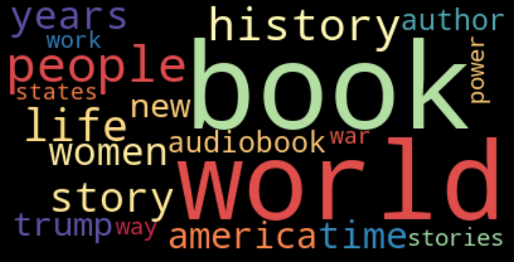

# Final-Project-Rec-System

## Outline

- Background

- Dataset Introduction

- EDA

- Model

- Front End

- Further Exploration

## Project Goal

The goal of this project is to create a content-based item-to-item recommendation system for books. 

## Data Introduction

The data was collected from Figshare, originally web scrapped from audible.com by Figshare account XinYuan Wang 2020. The data obtained 2 CSV files which covers all released books in the second half year of 2019. Important features in data includes book title, book author, book genre and book description.The files contain approximately 30,000 observations. 

## EDA

The graphic below shows distribution of each genre.

The graphic below shows average description word counts of each genre.

The graphic below shows the top 30 frequent words in 1000 randomly chosed samples with no limitation.

.png)

The graphic below shows the top 30 frequent words in 1000 randomly chosed samples captures noun only.

.png)

The graphic below shows the different top 20 frequent nouns between fiction and nonfiction.

The graphic below shows the different word cloud between fiction and nonfiction.

## Data Prepping

- Remove HTML signs by Regex before tokenozed each word.

- Create function for NLP to filter noun only in book descriptions.

## Model

### Cosine Similarity

- Test set Accuracy: 0.29, Epochs = 15

### Euclidean Similarity

- Test set Accuracy: 0.59, Epochs = 15

### Spacy

- Test set Accuracy: 0.63, Epochs = 15

  
## Insightful Analysis
 
- 'R', 'T', and 'V' were the most miss predicted
- Other signs were incorrectly predicted as 'U' and 'T' most often

 
## Further Exploration
 
- Enlarge the database to make recommendations more precise

- Use A/B testing to examine recommendation system performances

- Create a user-friendly searching environment by returning recommendations based on the closest input 

